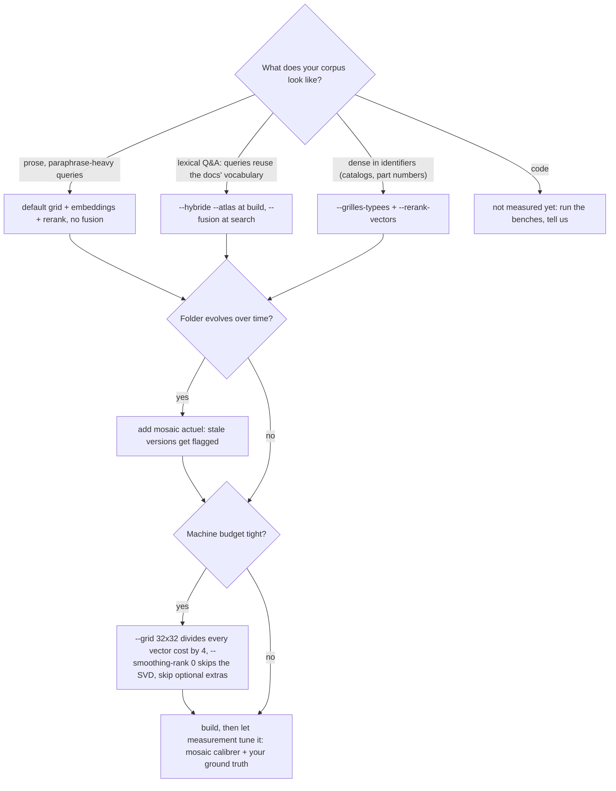

# Mosaic

**A sovereign semantic search engine — a mosaic of retrieval methods, assembled and
calibrated by measurement on *your* corpus. Local, deterministic, no LLM in the loop.**

The name is the architecture. Mosaic is not one clever algorithm: it is several
complementary retrieval processes — a semantic grid learned from your corpus, exact
lexical postings, static embeddings, a learned semantic atlas — each one measured,
kept only where it wins, and fused only where fusion wins. No cloud, no GPU, no
per-query bill, no data ever leaving your machine. The same corpus produces the same
index and the same ranking, on any machine.

It is built **agent-first** — compact JSON everywhere, an MCP server, usage guidance
embedded in tool descriptions: your agent sees five lines of JSON instead of thousands
of tokens of raw files — and **human-usable**: a plain CLI, explanations on demand
(`explain`, `--explique`), nothing you cannot run and read yourself.

## The idea

The engine does everything **mechanical**: index, retrieve, remember, and *measure its
own confidence* — deterministic, free, reproducible. An LLM (if you use one at all)
only enters at the **point of judgment**: never in the storage or search loop, only
when something must be *decided* — settling an ambiguity the engine itself has
flagged. The deterministic part carries the weight; intelligence only pays for the
irreducible.

And because no single retrieval method wins everywhere (we measured — see
[the campaign log](docs/MEASURES.md)), the engine does not pretend one does: you pick
the tiles of the mosaic per corpus, guided by measured evidence, and `mosaic calibrer`
tunes the weights on *your* ground truth.

## What it does

- **Semantic search** (`mosaic search`) — paraphrase-friendly retrieval over any
  folder (`.md`, `.txt`, `.pdf`, `.docx`, `.xlsx`, `.html`, `.pptx`, images via
  optional OCR). Query algebra opt-in (`--connecteurs`): *"A sans B"* pushes concept B
  down the ranking.
- **Typed grids** (`--grilles-typees`) — route meaning words, identifiers and path
  tokens to separate grids; identifier lookup stops drowning in prose (+7.5 pts on
  drowned references, measured on real product records).
- **Four-channel fusion** (`--hybride` + `--fusion`, `--atlas`) — grid + BM25 +
  embeddings + semantic atlas, fused by rank (RRF). Wins on lexical terrain; refused
  in degraded subsets, never a silent default.
- **Multi-channel identity card** — exact facets per document (*type*, *date*,
  *reference codes*): a code in your query triggers an exact-match boost; `--recence`
  blends rank with freshness; `--type` filters exactly.
- **Temporal truth** (`mosaic actuel`) — versions of the same aspect are grouped, the
  newest is canonical, older ones are flagged **stale**: an agent can no longer
  mistake outdated data for truth.
- **Cross-index meta-search** (`mosaic meta`) — several indexes at once, rank-fused,
  provenance kept.
- **Graph traversal without a graph database** (`mosaic chemin`) — two vector-space
  hops answer *"the other documents of the same project / the same year"*.
- **Belief memory** (`mosaic croyance`) — agents assert facts; the newest wins,
  history is kept, a hypervector layer provides a confidence margin, and the
  "contested" threshold can be conformally calibrated on your own store (error rate of
  confident answers guaranteed ≤ α).
- **Declarative per-index profile** (`mosaic profil`) — your world in ten lines of
  JSON: folder-tree roles, custom document types, your trade's reference-code shape.
  `--suggere` proposes one from a corpus scan.
- **Measured calibration** (`mosaic calibrer`) — encoding weights picked by benchmark
  on ground-truth queries (or deterministically generated ones, `--verite-auto`),
  recommending a change only when the gain is clear.
- **MCP server** (`infra_mcp/`) — all of the above as 10 MCP tools, dynamic domain
  discovery, zero dependencies beyond the engine.

## Choose your setup — the measured terrain map

There is no universal winner — every result below was measured both ways, defeats
included (the full stories live in [docs/MEASURES.md](docs/MEASURES.md)). The same
fusion that wins outright on lexical terrain *loses* on a paraphrase-heavy corpus,
where it divides the semantic-trap MRR by three: a rank fusion averages opinions,
which converges on lexical terrain and dilutes the grid's semantic wins elsewhere.
Pick by terrain — and know the bill before you flip a flag:



| Your corpus looks like | Measured best setup | Evidence | What it costs |
|---|---|---|---|
| Prose documents, paraphrase-heavy queries (knowledge bases, notes, procedures) | default grid + embeddings + `--rerank` — **no fusion** | private real-corpus bench: solo beats every fusion on MRR-semantic ×3; bundled bench 11/12 top-1 | disk ≈ vocab × 48 KB + 12 KB/doc; serving 18k docs ≈ 370 MB RAM, 27–63 ms warm; build is nightly-batch, its RAM grows with vocabulary (multi-GB beyond ~70k words); one shared 84 MB embedding table |
| Lexical Q&A — queries reuse the documents' own vocabulary (FAQ, homework, tickets) | four-channel fusion (`--hybride --atlas` + `--fusion`) | full Alloprof through the engine: quartet **0.5461 R@10** vs 0.5035 trio, 29 ms/query | the row above + BM25 postings (a few MB — an explicit word inventory of your docs: the privacy trade-off is yours) + 0.5 KB/doc rerank vectors + 4 KB/doc atlas maps + a build-time SOM (minutes, a few GB RAM at large vocabularies) |
| Catalogs and records dense in identifiers (products, part numbers, case files) | `--grilles-typees` (+ `--rerank-vectors`) | product bench: drowned ref 0.90 vs 0.825, bare ref 0.9917 with rerank | often *cheaper* than default: meaning grid up to 4× smaller when the vocabulary allows, identifier grids are tiny (768 dims ≈ 3 KB/word) |
| Folders that evolve over time, where stale versions are a trap | any of the above + `mosaic actuel` | temporal-truth bench (stale version ranked first by flat search, flagged by `actuel`) | free — reads the facets the index already stores |
| Code repositories | **unknown — not measured yet** | open question: for symbol lookup, grep/LSP are native and exact — the honest hypothesis to test is intent-to-code on mixed repos | — |

Two rules fall out of this table. First: **measure on your own corpus** — 20–40
ground-truth queries and the bundled benches (`bench/run_bench.py`,
`bench/fusion_bench.py`) settle in minutes what no doctrine can. Second: the roadmap
follows the same logic — `mosaic calibrer` already picks encoding weights from your
ground truth; teaching it to pick the *architecture* flags the same way is the natural
next step.

## Quickstart

```bash
pip install -e ".[dev,ingest]"        # core + document conversion
# optional extras: .[ocr] (scanned documents), .[rerank] (model2vec channels)

mosaic build ./my_documents -o ./index_docs
mosaic search "how do I wire the differential breaker" ./index_docs --top 5
mosaic explain <doc_id> ./index_docs --query "..."   # why did it match?
```

Everything is JSON on stdout — built for agents first, readable by humans. For agent
frameworks, run the MCP server (`infra_mcp/mosaic_mcp.py`): indexes stay open in
memory, warm answers in tens of milliseconds. Real output from the bundled benchmark
(paraphrased queries, no keyword overlap with the documents):

```bash
$ mosaic search "melanger de l'huile et un jaune pour une sauce onctueuse" ./index_bench --rerank
[{"id": "04_mayonnaise.md", "score": 0.4988, "score_rerank": 0.5507}, ...]
```

**Requirements:** Python ≥ 3.12, any OS (CI runs Linux; developed on Windows). No GPU,
no network access at runtime. Core dependency: numpy only.

## Measured performance

Headline numbers — the methods, the defeats and the full campaign stories are in
[docs/MEASURES.md](docs/MEASURES.md), and every figure is replayable from `bench/` or
`research/`.

| Benchmark | Result |
|---|---|
| Bundled paraphrase bench (40 docs, 12 traps) | 11/12 top-1 default, **12/12** with `--grilles-typees` |
| Alloprof (2,556 docs, 2,316 real queries) — single systems | Mosaic calibrated 0.385 R@10 > model2vec 0.379; BM25 0.482 |
| Alloprof — fusions | standard hybrid 0.498 < three-channel 0.517 < **engine quartet with `--atlas` 0.5461** (29 ms/query) |
| Real product records (private corpus, 500 refs) | drowned reference 0.90 vs 0.825 standard; bare ref 0.9917 with rerank |

Footprint, measured on production indexes (default 64×64×3 grid, plain CPU):

| Metric | Small index (579 docs) | Large index (18,070 docs) |
|---|---|---|
| Disk total | 1.55 GB | 3.79 GB |
| — document grids (int8) | **12.1 KB/doc** | 12.1 KB/doc |
| — co-occurrence profiles | 48.4 KB/word × 31k words | 48.2 KB/word × 72k words |
| Warm search latency (MCP server) | **27 ms** | **63 ms** |
| Process RAM with index open | — | **373 MB** (lazy memmaps) |
| Full build, all channels (40 docs) | 14.5 s | scales ~linearly, nightly-batch |

Levers if you need smaller/faster: `--grid 32x32` (÷4 every vector cost),
`--grilles-typees` on structured corpora (meaning grid up to 4× smaller, measured),
`--smoothing-rank 0` (skip the SVD: faster build, lower recall), skip optional extras.

## How it works — the tiles of the mosaic

Each document is encoded into a color grid — **12,288 dimensions (64×64×3) by
default**; typed grids size each grid to its own vocabulary in the (c,c,3) family, so
every grid still renders as a mosaic. The grid superposes a deterministic SHA-seeded
**signature** per token, a **co-occurrence profile** learned from *your* corpus
(PPMI + truncated SVD), and optionally a static **embedding**. Search is a cosine
against int8-quantized vectors — one reading per grid on a typed index, synthesized by
the query's idf mass.

<p align="center"><br><em>A real document from the bundled benchmark, as the engine sees it.</em></p>

Around that core, the other tiles: **BM25 postings** over the same token stream
(`--hybride`); a **semantic atlas** (`--atlas`) — a SOM learned from the co-occurrence
profiles, so neighboring cells hold related tokens, whose document heatmaps form a
4th fusion channel with errors decorrelated from the grid's; **relations**
(hyperdimensional binding by circular permutation) for graph hops; the **belief
memory** (bipolar MAP vectors) with conformal calibration.

Determinism, stated precisely: on a given machine, the same corpus produces the same
index bit for bit; across machines, the int8-quantized search matrix is provably
identical (BLAS float variance is absorbed by quantization — measured: 0 changed
values out of 24.5M) while float artifacts may differ in inert decimals — the
*ranking* is identical everywhere.

The research behind every design decision ships with the code (`research/`):
superposition capacity limits, multi-hop viability, conformal abstention, the atlas
track including its measured dead end — every mechanism was measured before it was
built, and the burials are documented next to the graduations.

## Language support (read this before installing)

Mosaic is currently **French-first**: tokenizer, stopwords, bundled lexicons and the
recommended embedding table target French corpora.

- **French** — native, fully supported; all benchmarks above are French.
- **English queries over French documents** — supported through a deterministic
  ~11.8k-term lexicon bridge.
- **Other Latin languages** (ES/IT/PT/DE) — partially usable, no bundled lexicon yet.
- **Non-Latin scripts (Arabic, CJK…)** — **not supported yet**: a query returns an
  empty list, not bad results.

The CLI is French-first too (`calibrer`, `chemin`, `actuel`, `--explique`…);
human-mode explanations are bilingual (`--langue en`).

## Limitations — the honest list

- **Bag-of-words semantics.** Word order beyond learned collocations is not encoded; a
  large transformer will beat it on subtle nuance — that is the price of sovereignty,
  and the reranker narrows it.
- **Linear scan latency.** Search is a full-corpus cosine: excellent up to tens of
  thousands of documents (63 ms @ 18k docs warm), not designed for millions — and the
  measured sub-linear shortcut (pyramid prefilter) failed its bench, so we did not
  ship it.
- **Disk is vocabulary-driven** (~48 KB per distinct word on the default grid). Large
  vocabularies mean multi-GB indexes; RAM stays low (lazy memmaps), budget the disk.
- **The engine recalls; it does not read.** It returns the right documents and why —
  your agent (or you) still reads them.

## Project status

**v0.1 — early.** Extracted from a private codebase where it was built and benchmarked
against real business corpora (thousands of real documents, ~550 tests, measured
research notes in `research/`). Day-to-day production usage is just beginning: expect
rough edges, and expect honest fixes.

## Why not just…

- **…BM25?** It wins alone on lexical terrain (we publish that defeat) and loses on
  paraphrase; the measured winner on lexical terrain is the fusion *with* the grid's
  decorrelated errors, not either system alone. The baseline ships in `bench/` —
  measure it on your own corpus.
- **…an embeddings API?** Every indexed document is a paid API call, re-paid on every
  rebuild, and your data leaves the machine. Mosaic rebuilds nightly for free, offline.
- **…a static embedding model alone (model2vec)?** Measured twice: behind the
  corpus-learned channels on the bundled paraphrase bench (MRR 0.830 vs 0.958) and
  behind calibrated Mosaic on Alloprof (0.379 vs 0.385). The corpus-learned channel is
  not decoration.
- **…a vector database?** That is infrastructure to run and secure. Mosaic is files on
  disk and one Python process.

## Scientific background

The mechanisms are standard, measured, and referenced in the code: PPMI + truncated
SVD (LSA lineage), hyperdimensional computing / MAP-VSA binding (Kanerva; Gayler),
self-organizing maps (Kohonen) for the atlas, reciprocal rank fusion (Cormack et al.),
conformal prediction for calibrated abstention (Vovk et al.), static embeddings via
model2vec distillation.

## Design principles

1. **Deterministic or explicit.** Same input, same ranking, any machine — bit-for-bit
   reproducible on the same machine. What cannot be guaranteed is stated, never
   silently degraded.
2. **The engine recalls, the caller judges.** Scores, margins, provenance and
   explanations are always exposed; ambiguity raises a flag instead of a silent guess.
3. **Parameters describe *your world*, never the geometry.** Profiles configure roles,
   types and codes; weights are calibrated by measurement; the core invariants are not
   knobs.
4. **Measured, defeats included.** No feature ships without a bench; no bench is
   quoted only when it flatters. The dead ends stay in `research/` next to the
   graduations.

## Development

```bash
pip install -e ".[dev]"
pytest -q            # ~550 tests, two CI regimes (with and without optional extras)
ruff check && ruff format
```

Architecture is enforced by import-linter contracts (core bricks never depend on the
orchestrator). CI runs both a lean profile (no extras) and a full one.

## License

Apache License 2.0 — see [LICENSE](LICENSE).

The bundled French↔English lexicon derived from [WikDict](https://www.wikdict.com/) is
redistributed under its own terms (CC BY-SA); see `src/mosaic/data/LICENSE_wikdict.txt`.
