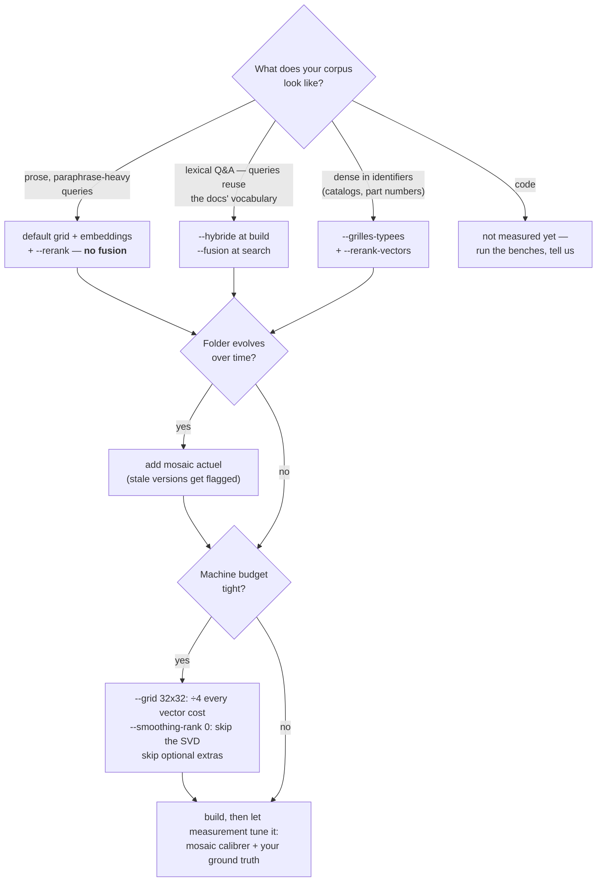

# Mosaic

**A sovereign semantic engine: search and remember by *meaning* — on a plain CPU, deterministically, with no LLM in the loop.**

No cloud, no GPU, no per-query bill, no data ever leaving your machine. On a given
machine, the same corpus always produces the same index, bit for bit; across machines,
the int8-quantized search matrix is provably identical (BLAS float variance is absorbed
by quantization — measured, see below), while float artifacts may differ in inert
decimals. Every document becomes a small **color grid** — a mosaic — and searching means
comparing grids: two texts about the same thing get two grids that are geometrically
close. The geometry is not fixed dogma: 64×64×3 by default, and with typed grids each
kind of data (meaning, identifiers, paths) gets its own grid, sized to its own
vocabulary.

<p align="center"><br><em>A real document from the bundled benchmark, as the engine sees it.</em></p>

## The idea

The engine does everything **mechanical**: index, retrieve, remember, and *measure its own
confidence* — deterministic, free, reproducible. An LLM (if you use one at all) only enters
at the **point of judgment**: never in the storage or search loop, only when something must
be *decided* — settling an ambiguity the engine itself has flagged. The deterministic part
carries the weight; intelligence only pays for the irreducible.

A practical consequence for agent builders: your agent sees **five lines of JSON instead of
thousands of tokens of raw files**. The engine is a token-saving machine by construction.

## What it does

- **Semantic search** (`mosaic search`) — paraphrase-friendly retrieval over any folder of
  documents (`.md`, `.txt`, `.pdf`, `.docx`, `.xlsx`, `.html`, `.pptx`, images via optional
  OCR). Query algebra built in: *"A sans B"* pushes concept B **down** the ranking.
- **Multi-channel identity card** — beyond meaning, each document carries exact **facets**:
  its *type* (spreadsheet, scanned pdf, photo…), its *date*, its *reference codes*. A code
  in your query triggers an **automatic exact-match boost**; `--recence` blends semantic
  rank with freshness; `--type` filters exactly.
- **Temporal truth** (`mosaic actuel`) — on an evolving folder, versions of the same aspect
  are grouped; the newest is **canonical**, older ones are flagged **stale**. An agent can
  no longer mistake outdated data for truth.
- **Typed grids** (`--grilles-typees`) — route each kind of data to its own grid (meaning /
  identifiers / paths / your custom types) and synthesize at read time. Identifier lookup
  stops drowning in prose (+7.5 pts on drowned references) and the meaning grid shrinks
  4×; plain-prose designations pay a small toll (measured below) — opt-in per corpus.
- **Cross-index meta-search** (`mosaic meta`) — query several indexes at once, fused by
  rank (RRF), each result keeping its provenance.
- **Graph traversal without a graph database** (`mosaic chemin`) — documents are linked to
  entities extracted from the folder tree (configurable roles); two vector-space hops
  answer *"the other documents of the same project / the same year"*.
- **Belief memory** (`mosaic croyance`) — agents assert facts (`entity, attribute, value`);
  the most recent fact wins, history is kept, and a VSA hypervector layer provides a
  **confidence margin**. When two values compete, the memory *says so* instead of guessing —
  and the threshold for "contested" can be **conformally calibrated on your own store**
  (`croyance calibrer --alpha 0.05`: after calibration, the error rate of confident answers
  is guaranteed ≤ α).
- **Declarative per-index profile** (`mosaic profil`) — adapt the engine to *your* world in
  ten lines of JSON: folder-tree roles (client/case, project/version…), custom document
  types (`.dwg` → plan), your trade's reference-code shape. `--suggere` scans a corpus and
  proposes a profile; `--explique` explains any profile in plain language (`--langue en`).
- **Measured calibration** (`mosaic calibrer`) — encoding weights are never hand-tuned:
  provide ground-truth queries (or generate them deterministically with `--verite-auto`,
  no LLM needed) and the benchmark picks the weights, recommending a change **only if the
  gain is clear**.
- **MCP server** (`infra_mcp/`) — all of the above exposed to agent frameworks as 10 MCP
  tools, with usage guidance embedded in the tool descriptions and dynamic domain
  discovery. Zero dependencies beyond the engine itself.

## Quickstart

```bash
pip install -e ".[dev,ingest]"        # core + document conversion
# optional extras: .[ocr] (scanned documents), .[rerank] (model2vec reranker)

mosaic build ./my_documents -o ./index_docs
mosaic search "how do I wire the differential breaker" ./index_docs --top 5
mosaic explain <doc_id> ./index_docs --query "..."   # why did it match?
```

Everything is JSON on stdout — built for agents first, humans second. Real output from
the bundled benchmark (paraphrased queries, no keyword overlap with the documents):

```bash
$ mosaic search "melanger de l'huile et un jaune pour une sauce onctueuse" ./index_bench --rerank
[{"id": "04_mayonnaise.md", "score": 0.4988, "score_rerank": 0.5507}, ...]

$ mosaic search "mon chocolat fondu redevient terne avec des marbrures" ./index_bench --rerank
[{"id": "31_chocolat_temperage.md", "score": 0.3000, "score_rerank": 0.3624}, ...]
```

**Requirements:** Python ≥ 3.12, any OS (CI runs Linux; developed on Windows). No GPU, no
network access at runtime. Core dependency: numpy only.

### Try the bundled benchmark

A small self-contained corpus (40 French cooking articles + 12 paraphrased ground-truth
queries) lives in `bench/`:

```bash
mosaic build bench/corpus -o ./index_bench
mosaic calibrer bench/corpus --requetes bench/verite.jsonl --explique
```

On this corpus the engine reaches **11/12 top-1, 12/12 top-3** with the recommended
profile (**12/12 top-1** with `--grilles-typees` — the last paraphrase trap falls once
path noise is quarantined in its own grid) — and the calibration demo shows the optimal
weights *differ* from the defaults, which is the point: every corpus has its own optimum,
and measurement finds it.

### A larger benchmark: Alloprof (2,556 docs, 2,316 real queries)

The bundled corpus is small by design. For scale, `bench/alloprof.py` downloads the
[Alloprof](https://huggingface.co/datasets/lyon-nlp/alloprof) French homework-help dataset
(the same corpus MTEB uses to evaluate French retrieval — CC BY-NC-SA, fetched on demand
via the public Hugging Face API, never redistributed with this repo) and converts it to
the bench format:

```bash
python bench/alloprof.py
python bench/run_bench.py bench/alloprof/corpus bench/alloprof/verite.jsonl \
    --config alloprof --no-path-tokens --weights 0.5,0.3,0.2 \
    --embeddings <table.msee> --abtt 2
python bench/baseline_model.py bench/alloprof/corpus bench/alloprof/verite.jsonl
python bench/fusion_bench.py bench/alloprof/corpus bench/alloprof/verite.jsonl \
    --weights 0.5,0.3,0.2 --no-path-tokens
```

Measured results (Windows, plain CPU), defeats included:

| System | Recall@10 | MRR |
|---|---|---|
| RRF fusion: Mosaic + BM25 + model2vec | **0.517** | **0.324** |
| RRF fusion: BM25 + model2vec (the standard hybrid) | 0.498 | 0.311 |
| BM25 alone | 0.482 | 0.310 |
| Mosaic, calibrated (see below) | 0.385 | 0.259 |
| model2vec alone (potion-multilingual-128M) | 0.379 | 0.228 |
| Mosaic, stock defaults | 0.307 | 0.212 |

What this benchmark taught us — kept here because it is the honest story:

- **This is BM25's home turf.** Student questions reuse the documents' exact vocabulary,
  and the queries are long and noisy (greetings, pasted exercise text). Mosaic's stock
  defaults — calibrated on a different corpus — scored 0.307.
- **The shipped levers close most of the gap.** `--no-path-tokens` (the corpus files are
  named by UUID; indexing path tokens injects hex noise into every grid) is worth +1.5 pts.
  Running `mosaic calibrer` on 386 sample queries picked markedly more lexical weights
  (0.50/0.30/0.20) for +6.3 more pts. Calibrated, Mosaic (0.385) edges out model2vec
  (0.379) — an engine with no pretraining, tuned by measurement, passing a trained model
  on terrain that favors neither.
- **The three-channel fusion wins outright.** RRF over (Mosaic + BM25 + model2vec) beats
  the standard BM25+model2vec hybrid: Mosaic's errors are decorrelated from both. And the
  same fusion with *uncalibrated* Mosaic scored 0.475 — below BM25 alone. A fusion is only
  as good as its worst-configured channel.
- **Determinism holds at scale.** Two independent builds returned identical metrics to the
  fourth decimal (0.3848 / 0.2593).

## Which setup for which terrain (measured)

There is no universal winner — every result below was measured both ways, defeats
included. The same three-channel fusion that wins outright on Alloprof *loses* on a
paraphrase-heavy private corpus: it gains +2.5 pts of recall but drops 4 pts of MRR and
divides the semantic-trap MRR by three (0.153 solo vs 0.051 fused). A rank fusion
averages its channels' opinions; on lexical terrain that averages toward the truth, on
semantic terrain it dilutes exactly the wins the grid exists for. Pick by terrain — and
know the bill before you flip a flag:



| Your corpus looks like | Measured best setup | Evidence | What it costs |
|---|---|---|---|
| Prose documents, paraphrase-heavy queries (knowledge bases, notes, procedures) | default grid + embeddings + `--rerank` — **no fusion** | private real-corpus bench: solo beats every fusion on MRR-semantic ×3; bundled bench 11/12 top-1 | disk ≈ vocab × 48 KB + 12 KB/doc; serving 18k docs ≈ 370 MB RAM, 27–63 ms warm; build is nightly-batch, its RAM grows with vocabulary (multi-GB beyond ~70k words); one shared 84 MB embedding table |
| Lexical Q&A — queries reuse the documents' own vocabulary (FAQ, homework, tickets) | three-channel fusion (`--hybride` + `--fusion`) | Alloprof 2,556 docs: 0.517 R@10 vs 0.498 standard hybrid, 0.482 best single | the row above + BM25 postings (a few MB — an explicit word inventory of your docs: the privacy trade-off is yours) + 0.5 KB/doc rerank vectors; three scans per query, still milliseconds |
| Catalogs and records dense in identifiers (products, part numbers, case files) | `--grilles-typees` (+ `--rerank-vectors`) | product bench: drowned ref 0.90 vs 0.825, bare ref 0.9917 with rerank | often *cheaper* than default: meaning grid up to 4× smaller when the vocabulary allows, identifier grids are tiny (768 dims ≈ 3 KB/word); same serving class |
| Folders that evolve over time, where stale versions are a trap | any of the above + `mosaic actuel` | temporal-truth bench (stale version ranked first by flat search, flagged by `actuel`) | free — reads the facets the index already stores |
| Code repositories | **unknown — not measured yet** | open question; identifier-dense (typed grids are a candidate), but code has structure none of our benches cover | — |

One **research** channel sits outside this table: semantic-atlas heatmaps (a
SOM-organized grid, `research/atlas_som.py` / `atlas_fusion.py` / `atlas_capacite.py`).
Fused as a 4th channel with the trio it measured **+2.8 pts Recall@10 and +3.7 MRR on
the full Alloprof corpus** (0.532 vs 0.503, both with this bench's canonical-token BM25
channel) — its errors decorrelate from the flat grid's. The bill: a build-time SOM over
the whole vocabulary (~4 GB RAM peak and ~20 min at 72k words, chunked) — and its
pyramid-prefilter variant was measured dead (step 3, control included). It is not an
engine flag yet: adopting it is an open engineering decision.

Two rules fall out of this table. First: **measure on your own corpus** — 20–40
ground-truth queries and the bundled benches (`bench/run_bench.py`,
`bench/fusion_bench.py`) settle in minutes what no doctrine can. Second: the roadmap
follows the same logic — `mosaic calibrer` already picks encoding weights from your
ground truth; teaching it to pick the *architecture* flags (typed? fused? reranked?) the
same way is the natural next step.

## The features, each one measured

### Native three-channel fusion (`--hybride` / `--fusion`)

The winning architecture of the Alloprof benchmark is built in — one flag at build time, one at search time:

```bash
mosaic build ./docs -o ./index --hybride     # BM25 postings + model2vec vectors
mosaic search "your query" ./index --fusion  # RRF over all three channels
```

`--hybride` stores BM25 postings (`bm25.msbm`) over the same token stream the grid sees
(canonicalization + collocations) and implies `--rerank-vectors`. It is opt-in because a
bag of words reveals more about your documents than the grid does — the storage trade-off
is yours to make, never a silent default. `--fusion` ranks the whole corpus per channel,
fuses by Reciprocal Rank Fusion (K=60), drops any channel with no signal on the query,
and reports each result's per-channel rank for explainability. Because the grid+BM25 duo
*without* embeddings measured below BM25 alone (0.460 < 0.482), fusion requires all three
channels and fails loudly otherwise.

### Typed grids (`--grilles-typees`)

The encoder can **sort at write time**: each kind of data goes to *its own* grid — meaning
words in one, identifiers (reference codes) in another, path tokens in a third, plus any
custom types your profile declares (`grilles` key, routing patterns). Each grid gets its
own recipe: weights (the ref grid is pure signature — an identifier is lexical), smoothing
(never on identifiers — pulling two neighboring codes together manufactures confusions),
and dimensions sized to its actual vocabulary (reported by `stats()`). At read time the
synthesis weighs each grid by the query's idf mass per type, with **precedence for the ref
reading** when the query carries an identifier (rare token, df ≤ 2 — threshold calibrated
by measurement); `lectures` exposes the per-grid cosine.

```bash
mosaic build ./docs -o ./index --grilles-typees
mosaic search "a9f77216 breaker" ./index    # the synthesis routes by itself
```

Measured on 500 real product records (private corpus — the replayable public counterpart
is the bundled bench: `python bench/run_bench.py bench/corpus bench/verite.jsonl
--grilles-typees`, 12/12 top-1 vs 11/12 standard) against the standard engine *with* its
facet-based ref boost: a reference drowned in noise words **0.90 vs 0.825**, bare
reference 0.9833 vs 0.975, cross-vendor join 1.0 on both sides, plain designations 0.9333
vs 0.9667 — with a meaning grid **4× smaller** (3,072 dims vs 12,288) when the vocabulary
allows it (grid dimensions grow automatically with vocabulary, so the saving is
corpus-dependent). On prose with nothing to sort
(Alloprof) it is neutral-to-slightly-negative, so it stays **opt-in per corpus**, never a
default. Existing indexes remain readable and searchable unchanged. `--rerank` works on a
typed index (build with `--grilles-typees --rerank-vectors`): the λ·synthesis +
(1−λ)·cos_m2v blend re-sorts the top-depth, and the ref reading keeps **primary-key
precedence** — an embedding cosine cannot dethrone the exact holder of an identifier.
Measured on the 500-record product bench: bare ref 0.9917 (vs 0.9833 without rerank),
drowned ref 0.9083 (vs 0.90), designations unchanged — the reranker helps on identifier
terrain and costs nothing elsewhere.

### Embeddings (optional but recommended)

The third encoding channel uses a static [model2vec](https://github.com/MinishLab/model2vec)
table distilled from fastText. Build it once, locally:

```bash
python scripts/import_wikdict.py      # optional EN->FR lexicon bridge
python scripts/prepare_potion.py      # builds the local embedding table
mosaic build ./docs -o ./index --embeddings <table.msee> --abtt 2 --rerank-vectors
```

## How it works

Each document is encoded into a color grid — **12,288 dimensions (64×64×3) by default**;
with typed grids, each grid is sized to its own vocabulary within the (c,c,3) family, so
every grid still renders as a mosaic. The grid superposes three
channels: a deterministic SHA-seeded **signature** per token, a **co-occurrence profile**
learned from *your* corpus (PPMI + truncated SVD), and optionally a static **embedding**.
Search is a cosine against int8-quantized vectors — one reading per grid on a typed
index, synthesized by the query's idf mass. Separate channels carry **relations**
(hyperdimensional binding by circular permutation) and the **belief memory** (bipolar MAP
vectors). Everything is seeded, integer-quantized, and reproducible — the int8 quantization
provably absorbs cross-machine BLAS variance (measured: 0 changed values out of 24.5M).

The research behind the design decisions ships with the code (`research/`): superposition
capacity limits, multi-hop traversal viability (pure-value binding, cleanup per hop),
conformal abstention, held-out deterministic ground truth — every mechanism was measured
before it was built.

## Measured footprint & performance

Real numbers, measured on production indexes (Windows, plain CPU, default 64×64×3 grid):

| Metric | Small index (579 docs) | Large index (18,070 docs) |
|---|---|---|
| Disk total | 1.55 GB | 3.79 GB |
| — document grids (`docs.msei`, int8) | **12.1 KB/doc** | 12.1 KB/doc |
| — co-occurrence profiles (`vocab.msev`) | 48.4 KB/word × 31k words | 48.2 KB/word × 72k words |
| Warm search latency (MCP server, float32 cache) | **27 ms** | **63 ms** |
| Warm search latency (memory-lean int8 path) | 27 ms | 832 ms |
| Cold CLI call (incl. Python startup) | 1.9 s | — |
| Process RAM with index open | — | **373 MB** |
| Full build, embeddings + reranker + SVD (40 docs) | 14.5 s | scales ~linearly |

How to read this:

- **A document costs ~12 KB.** The per-document grid is tiny; disk is dominated by the
  **vocabulary** (one 48 KB float32 profile per distinct word). Index size ≈ vocab × 48 KB.
- **RAM does not pay for disk.** Indexes open as lazy memory-maps: the 3.8 GB index runs in
  ~370 MB of process RAM — only the profile rows your queries touch are ever read.
- **Latency scales linearly with corpus size** (int8 cosine over all documents). The MCP
  server keeps indexes open (warm path); the CLI pays Python startup on every call.
- **Levers if you need smaller/faster:** `--grid 32x32` divides every vector cost by ~4;
  on structured corpora `--grilles-typees` shrinks the meaning grid 4× *and* improves
  identifier lookup (measured above); `--smoothing-rank 0` skips the SVD (faster builds,
  lower recall); skipping `--rerank-vectors` and embeddings keeps the engine pure and
  minimal.
- **Typed grids change the arithmetic:** each grid's vocabulary costs dims × 4 bytes — a
  3,072-dim meaning grid is 12 KB/word, a 768-dim identifier grid 3 KB/word. The
  18k-document index above was rebuilt with `--grilles-typees` and verified in place:
  12/12 identifier lookups at rank 1, 27–154 ms warm.
- One-time shared artifacts: the optional embedding table is **84 MB** (built locally by
  `scripts/prepare_potion.py`, shared across all indexes).
- Belief memory: ~1 ms per assert/read, **82 MB per 50,000 facts** (measured,
  `research/bench_croyance_echelle.py`).

Every number above is reproducible: build the bundled `bench/corpus` and time it yourself.

## Language support (read this before installing)

Mosaic is currently **French-first**: the tokenizer, stopword list, bundled lexicons and the
recommended embedding table are built for French corpora.

- **French** — native, fully supported. All benchmarks above are French.
- **English queries over French documents** — supported through a deterministic ~11.8k-term
  lexicon bridge; measured equivalent to the native French query when the terms are covered.
- **Other Latin languages** (ES/IT/PT/DE) — partially usable (Latin tokenizer), no bundled
  lexicon yet.
- **Non-Latin scripts (Arabic, CJK…)** — **not supported yet** (the tokenizer is
  Latin-only); a query returns an empty list, not bad results.

The **CLI is French-first** too (`mosaic calibrer`, `chemin`, `actuel`, `--explique`…).
Human-mode explanations are bilingual (`--langue en`); English command aliases are on the
roadmap.

## Limitations — the honest list

- **Bag-of-words semantics.** Word order beyond learned collocations is not encoded; it
  retrieves by lexical-semantic content, not fine-grained syntax. A large transformer will
  beat it on subtle nuance — that is the price of sovereignty, and the reranker narrows it.
- **Linear scan latency.** Search is a full-corpus cosine: excellent up to tens of
  thousands of documents (63 ms @ 18k docs on the warm server path), not designed for
  millions.
- **Disk is vocabulary-driven** (~48 KB per distinct word). Very large vocabularies mean
  multi-GB indexes — RAM stays low (lazy memmaps), but budget the disk.
- **The engine recalls; it does not read.** It returns the right documents and why — your
  agent (or you) still reads them.

## Project status

**v0.1 — early.** Extracted from a private codebase where it was built and benchmarked
against real business corpora (thousands of real documents, ~540 tests, measured research
notes in `research/`). Day-to-day production usage is just beginning: expect rough edges,
and expect honest fixes.

## Why not just…

- **…BM25?** Beaten on paraphrase benchmarks by the co-occurrence + embedding channels —
  but it wins alone on lexical terrain (see the Alloprof benchmark above), which is why
  the measured winner is the three-channel fusion, not either system alone (BM25 baseline
  ships in `bench/` — measure it on your own corpus).
- **…an embeddings API?** Every indexed document is a paid API call, re-paid on every
  rebuild, and your data leaves the machine. Mosaic rebuilds nightly for free, offline.
- **…a static embedding model alone (model2vec)?** Measured twice. On the bundled
  paraphrase benchmark: embeddings-only scores **MRR 0.830**, the home-grown channels
  alone (signature + corpus-learned co-occurrence) score **0.958**. On the 2,556-document
  Alloprof benchmark above — hostile terrain — calibrated Mosaic still edges model2vec
  (0.385 vs 0.379 Recall@10), and fusing both with BM25 beats every single system and the
  standard hybrid. The corpus-learned channel is not decoration. Reproduce it yourself:
  `mosaic calibrer bench/corpus --requetes bench/verite.jsonl --embeddings <table>`.
- **…a vector database?** That is infrastructure to run and secure. Mosaic is files on
  disk and one Python process.

## Scientific background

The mechanisms are standard, measured, and referenced in the code: PPMI + truncated SVD
(LSA lineage), hyperdimensional computing / MAP-VSA binding (Kanerva; Gayler), reciprocal
rank fusion (Cormack et al.), conformal prediction for calibrated abstention (Vovk et al.),
static embeddings via model2vec distillation.

## Design principles

1. **Deterministic or explicit.** Same input, same ranking, any machine — and bit-for-bit
   reproducible on the same machine. What cannot be guaranteed (float decimals across
   BLAS implementations) is stated, never silently degraded.
2. **The engine recalls, the caller judges.** Scores, margins, provenance and explanations
   are always exposed; ambiguity raises a flag instead of a silent guess.
3. **Parameters describe *your world*, never the geometry.** Profiles configure roles,
   types and codes; encoding weights are calibrated by measurement; the core invariants
   (hashing, quantization, dimensions) are not knobs.
4. **Agent-first interfaces.** Compact JSON everywhere, usage guidance embedded in the MCP
   tool descriptions, errors that tell the caller how to fix the call.

## Development

```bash
pip install -e ".[dev]"
pytest -q            # ~540 tests, two CI regimes (with and without optional extras)
ruff check && ruff format
```

Architecture is enforced by import-linter contracts (core bricks never depend on the
orchestrator). CI runs both a lean profile (no extras) and a full one.

## License

Apache License 2.0 — see [LICENSE](LICENSE).

The bundled French↔English lexicon derived from [WikDict](https://www.wikdict.com/) is
redistributed under its own terms (CC BY-SA); see `src/mosaic/data/LICENSE_wikdict.txt`.
